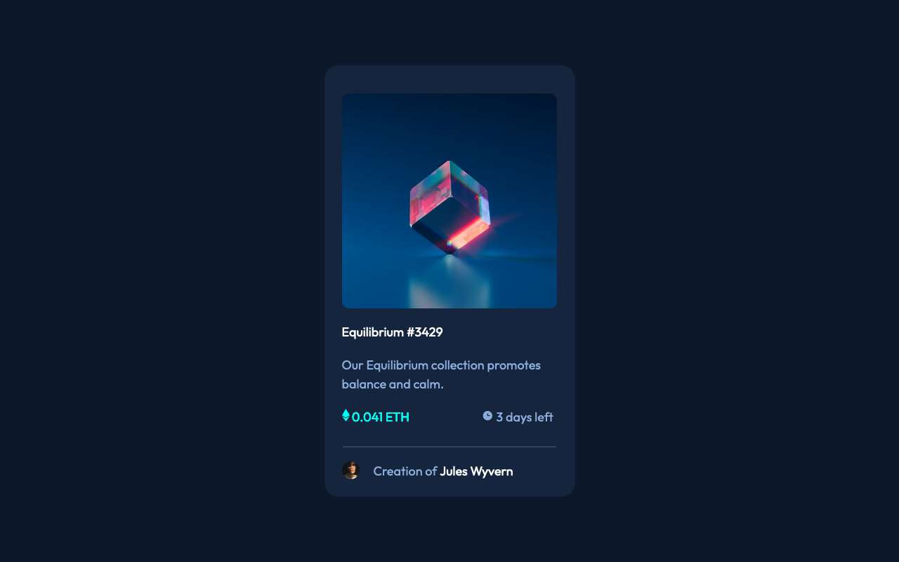

# Frontend Mentor - NFT preview card component solution

This is a solution to the [NFT preview card component challenge on Frontend Mentor](https://www.frontendmentor.io/challenges/nft-preview-card-component-SbdUL_w0U). Frontend Mentor challenges help you improve your coding skills by building realistic projects.

## Table of contents

- [Overview](#overview)
  - [The challenge](#the-challenge)
  - [Screenshot](#screenshot)
  - [Links](#links)
- [My process](#my-process)
  - [Built with](#built-with)
  - [What I learned](#what-i-learned)
  - [Continued development](#continued-development)
  - [Useful resources](#useful-resources)
- [Author](#author)

**Note: Delete this note and update the table of contents based on what sections you keep.**

## Overview

### The challenge

Users should be able to:

- View the optimal layout depending on their device's screen size
- See hover states for interactive elements

### Screenshot

.

### Links

- Solution URL: [nft_preview_card_component](https://github.com/mayor-creator/nft_preview_card_component)
- Live Site URL: [nft_preview_card_component](https://your-live-site-url.com)

## My process

### Built with

- HTML5 markup
- CSS custom properties
- Flexbox
- Mobile-first workflow

### What I learned

```css
.proud-of-this-css {
	min-height: 100vh;
}
```

### Continued development

- css property opacity.
- css spacing.

### Useful resources

- [HTML&CSS book by Jon Duckett](https://www.amazon.com/HTML-CSS-Design-Build-Websites/dp/1118008189) - explaining how the background-position of imgage works. I really liked this book and I will using it going forward.

## Author

- Frontend Mentor - [@mayor-creator](https://www.frontendmentor.io/profile/mayor-creator)
- Twitter - [@mayor_creator](https://twitter.com/mayor_creator)
